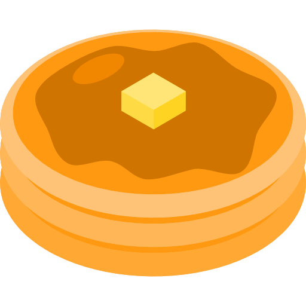

<!-- PROJECT SHIELDS -->
[![Contributors][contributors-shield]][contributors-url]
[![Forks][forks-shield]][forks-url]
[![Stargazers][stars-shield]][stars-url]
[![Issues][issues-shield]][issues-url]

<!-- PROJECT LOGO -->
 

  

<h3 align="center">PancakeProject</h3>

  

    Web interface for an automatic pancake machine project
     
    <!-- <a href="https://github.com/FragDev/PancakeProject"><strong>Explore the docs »</strong></a>
     
      -->
    <!-- <a href="https://github.com/FragDev/PancakeProject">View Demo</a> -->
    <a>View Demo</a>
    ·
    <a href="https://github.com/FragDev/PancakeProject/issues">Report Bug</a>
    ·
    <a href="https://github.com/FragDev/PancakeProject/issues">Request Feature</a>
  

<!-- TABLE OF CONTENTS -->

  
Table of Contents

  <ol>
    <li>
      <a href="#about-the-project">About The Project</a>
      <ul>
        <li><a href="#built-with">Built With</a></li>
      </ul>
    </li>
    <li><a href="#roadmap">Roadmap</a></li>
    <li><a href="#contact">Contact</a></li>
  </ol>

<!-- ABOUT THE PROJECT -->
## About The Project

![Product Name Screen Shot][product-screenshot]

This web interface is a personal study project and aims to control my automatic pancake machine.

(<a href="#top">back to top</a>)

### Built With

* [PHP](https://php.net/)
* [TailwindCSS](https://tailwindcss.com/)
* [DaisyUI](https://daisyui.com/)

(<a href="#top">back to top</a>)

<!-- ROADMAP -->
## Roadmap

- [ ] Admin Panel
- [ ] User Stats
- [ ] More secure

See the [open issues](https://github.com/FragDev/PancakeProject/issues) for a full list of proposed features (and known issues).

(<a href="#top">back to top</a>)

<!-- CONTACT -->
## Contact

Fragment - [@fragment_dev](https://twitter.com/fragment_dev) - clemcailly@gmail.com

Project Link: [https://github.com/FragDev/PancakeProject](https://github.com/FragDev/PancakeProject)

(<a href="#top">back to top</a>)

<!-- MARKDOWN LINKS & IMAGES -->
<!-- https://www.markdownguide.org/basic-syntax/#reference-style-links -->
[contributors-shield]: https://img.shields.io/github/contributors/FragDev/PancakeProject.svg?style=for-the-badge
[contributors-url]: https://github.com/FragDev/PancakeProject/graphs/contributors
[forks-shield]: https://img.shields.io/github/forks/FragDev/PancakeProject.svg?style=for-the-badge
[forks-url]: https://github.com/FragDev/PancakeProject/network/members
[stars-shield]: https://img.shields.io/github/stars/FragDev/PancakeProject.svg?style=for-the-badge
[stars-url]: https://github.com/FragDev/PancakeProject/stargazers
[issues-shield]: https://img.shields.io/github/issues/FragDev/PancakeProject.svg?style=for-the-badge
[issues-url]: https://github.com/FragDev/PancakeProject/issues
[product-screenshot]: assets/preview.png
